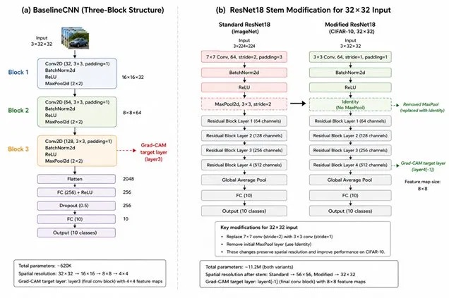

# CIFAR-10 Interpretable CNNs
## Visual Explanations for Image Classification on CIFAR-10

This project studies **how and why** CNNs make decisions on CIFAR-10 using Grad-CAM from scratch, model comparisons, and formal interpretability metrics. It evaluates whether stronger accuracy also leads to more meaningful explanations, and whether the explanations remain stable under sanity checks and library parity tests.

---

## Project Aim

The goal of the project is to build an end-to-end explainable image classification pipeline for CIFAR-10 and compare three model variants:

- `baseline_cnn`: a lightweight 3-block CNN trained from scratch.
- `resnet18_scratch`: ResNet18 adapted for 32×32 inputs and trained from random initialization.
- `resnet18_pretrained`: the same adapted ResNet18, initialized with ImageNet weights and fine-tuned on CIFAR-10.

The project does not stop at accuracy. It also checks whether the resulting saliency maps are faithful, stable, and sensitive to learned representations using parity validation, Adebayo-style sanity checks, and quantitative XAI metrics.

---

## Repository Structure

```text
main.py              # pipeline orchestrator
train.py             # training loop
models.py            # BaselineCNN and ResNet18 variants
data.py              # CIFAR-10 data pipeline
gradcam.py           # Grad-CAM from scratch
sanity_checks.py     # model/data randomization tests
utils.py             # shared helpers
configs/config.yaml  # experiment configuration
outputs/             # curves, heatmaps, eval plots, metrics
LOG.md               # research log
```

---

## Models



### BaselineCNN
A compact 3-layer CNN designed for CIFAR-10. It uses three convolutional blocks, batch normalization, ReLU, max pooling, and a small MLP classifier head. Grad-CAM is attached to the last convolutional block.

### ResNet18-scratch
A modified ResNet18 for 32×32 images. The first convolution is changed from the ImageNet stem to a 3×3 stride-1 convolution, the initial max-pooling layer is removed, and the final classifier is replaced with a 10-class head.

### ResNet18-pretrained
The same CIFAR-10-adapted ResNet18, but initialized from ImageNet weights and fine-tuned. This is the strongest model in both accuracy and interpretability quality.

---

## Data Pipeline

CIFAR-10 contains 10 classes with 50,000 training images and 10,000 test images. The code verifies class balance explicitly and uses the training-set normalization statistics only, avoiding leakage.

Training augmentation includes random crops with padding and horizontal flips, while evaluation uses only tensor conversion and normalization. Vertical flips are intentionally avoided because they are not natural for this dataset.

---

## Grad-CAM Method

Grad-CAM is implemented fully from scratch using forward and backward hooks. The implementation follows the standard recipe: capture feature maps and gradients from the target convolutional layer, average gradients spatially to get channel weights, combine them linearly, apply ReLU, and upsample to input resolution.

For a class $c$, the Grad-CAM heatmap is computed as:

$$\alpha_k^c = \frac{1}{Z}\sum_i \sum_j \frac{\partial y^c}{\partial A_{ij}^k}$$

$$L_{\mathrm{Grad-CAM}}^c = \mathrm{ReLU}\left(\sum_k \alpha_k^c A^k\right)$$

where $A^k$ is the $k$-th feature map, $y^c$ is the class logit, and $Z$ is the number of spatial locations. The raw logit is used instead of softmax to avoid class competition effects.

---

## Quantitative Metrics

The report includes formal metric definitions for each of the four quantitative measures used.

### Localization Consistency Score
Measures whether heatmaps for the same class look similar across multiple images. Computed as the mean pairwise SSIM among Grad-CAM maps from the same class. Higher values mean more consistent localization.

### Energy-Based Explanation Concentration
Measures how concentrated the heatmap energy is in the top activated pixels. Computed from the normalized heatmap mass over the top $p\%$ of pixels. Higher values mean the explanation is more compact.

### Inter-Class Discriminability
Measures how different the class-wise explanation distributions are from each other. A higher value means class-specific explanations are more separable.

### Randomization Sensitivity
Checks whether explanations degrade as model layers are progressively randomized. A valid explanation method should become less stable as learned weights are destroyed.

---

## Main Results

| Model | Test Accuracy | Notes |
|---|---:|---|
| BaselineCNN | 87.10% | Good lightweight baseline, but explanations are coarse. |
| ResNet18-scratch | 92.93% | Better localization and stronger learned structure. |
| ResNet18-pretrained | 96.16% | Best overall accuracy and most semantically meaningful heatmaps. |

The Grad-CAM implementation matched the reference library extremely closely, with Spearman correlation reported as 1.0 for all three models. The project also reports successful parity and sanity behavior in the notebook outputs.

---

## Interpretability Findings

The baseline CNN tends to produce broader and less selective heatmaps because its final spatial representation is small and the architecture is shallow. ResNet18-scratch improves localization, but its maps are still less semantically stable than the pretrained model's maps. ResNet18-pretrained gives the sharpest and most meaningful explanations, which supports the idea that ImageNet priors transfer useful visual structure to CIFAR-10.

These findings are consistent with the formal metric summary: pretrained ResNet18 scores best on localization consistency and inter-class discriminability, while the baseline CNN has the highest explanation concentration but the weakest semantic structure.

---

## Sanity Checks

Two sanity checks were used to verify that the heatmaps are tied to the model, not just the input statistics.

- **Model randomization:** progressively randomizes weights to see whether Grad-CAM changes.
- **Data randomization:** trains on shuffled labels to test whether heatmaps still look plausible.

These checks are important because saliency methods can sometimes look convincing even when they are not actually faithful to the learned model.

---

## Recent Literature

Suggested areas to cover in the report:
- post-2019 saliency faithfulness studies,
- explanation stability and robustness,
- quantitative XAI evaluation,
- human-centered interpretability studies,
- recent work on explanation benchmarking for vision models.

---

## Timeline

- **Week 1:** Repository setup, dataset inspection, and preprocessing pipeline.
- **Week 2:** Hayam A. Rezk worked on architecture design, training infrastructure, and the first training pipeline runs.
- **Week 3:** Mohammed A. Anber worked on Grad-CAM from scratch and the first sanity checks.
- **Week 4:** Joint work on model training, evaluation, and Grad-CAM visualization refinement.
- **Week 5:** Hayam A. Rezk worked on all 100-epoch GPU runs, training curves, and dropout ablation.
- **Week 6:** Mohammed A. Anber worked on Grad-CAM++ comparison and the LCS/EEC/ICD/RS metrics and statistics. Joint work on experimental analysis and report writing.

---

## Usage

```bash
pip install -r requirements.txt
python main.py --stages data
python main.py --stages train
python main.py --stages eval gradcam
python main.py
```

The pipeline saves curves, confusion matrices, Grad-CAM grids, sanity-check plots, checkpoints, and XAI metric outputs into the `outputs/` and `models/` folders.

---

## Key Contributions

- Grad-CAM implemented from scratch with correct hook handling.
- Verified parity against a standard Grad-CAM library.
- Strong experimental comparison across three model variants.
- Formal XAI metrics and sanity checks added for quantitative evaluation.
- Honest analysis of limits caused by low-resolution CIFAR-10 images.

---

## References

- Selvaraju et al., Grad-CAM: Visual Explanations from Deep Networks via Gradient-Based Localization. ICCV 2017. https://arxiv.org/abs/1610.02391
- Adebayo et al., Sanity Checks for Saliency Maps. NeurIPS 2018. https://arxiv.org/abs/1810.03292
- He et al., Deep Residual Learning for Image Recognition.
- Krizhevsky, Learning Multiple Layers of Features from Tiny Images.
